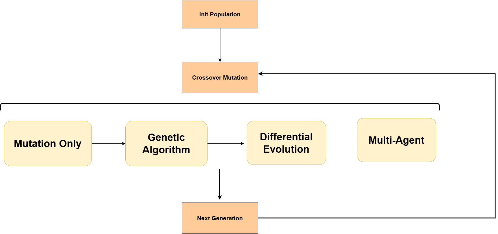

# Genetic-algorithm-and-LLM-based-Triton-cpu-optimization
**团队成员 (Contributors)：**
杨玺禾、于宛扬 、郭芮含
## Background
深度学习算子的性能表现已成为制约系统整体效率的核心瓶颈之一。Triton 作为高性能算子开发框架，为开发者提供了简洁的抽象接口，大幅降低了高性能算子的实现门槛，但在 CPU 后端的优化仍面临诸多挑战，亟需高效的自动优化方案。

当前主流的优化思路中，仅依赖大语言模型（LLM）存在明显局限：尽管 LLM 具备强大的代码生成与优化能力，但优化过程效率低下、资源消耗过大，难以在庞大的算子优化搜索空间中快速定位最优解。而遗传算法等进化算法虽能引导搜索过程高效收敛，但缺乏语义理解能力，易产生语义错误。

为解决上述问题，本项目提出了一种结合 **大语言模型 (LLMs)** 强大的代码生成能力与 **进化算法 (Evolutionary Algorithms)** 全局搜索能力的自动化优化框架 。通过引入遗传算法 (GA)、差分进化 (DE) 以及多智能体 (Multi-Agent) 协作机制，本框架能够引导 LLM 在巨大的搜索空间中快速收敛到高性能的算子实现 。

主要贡献：
* 对比了爬山算法 (ParaEvoluter)、遗传算法 (GA) 和差分进化 (DE) 在算子优化中的表现 。
* 设计了 **MACO (Multi-Agents Code Optimization)** 系统，利用角色扮演 (Role-Playing) 的 Agent 针对 Tiling、Vectorization 等特定方向进行优化 。
* 实现了 Triton CPU 算子的自动化迭代与性能评估 。
## Overview
### 1. 整体架构


```
Genetic-algorithm-and-LLM-based-Triton-cpu-optimization/
├── evolution_algorithms/       # 核心进化算法实现
│   ├── evoluter.py            # 进化算法基类与逻辑
│   ├── evaluator.py           # 代码性能评估器 (Latency测算)
│   ├── llm_handler.py         # LLM API 调用接口 (Deepseek等)
│   ├── init_generator.py      # 初始种群生成
│   ├── main.py                # 进化算法主入口
│   ├── run_benchmark.sh       # 批量运行脚本
│   ├── visualize_result.py    # 可视化效果分析
│   └── outputs/               # 迭代过程中的最佳代码与指标日志
│
├── multi_agent/               # 多智能体协作优化实现 (MACO)
│   ├── evolution_main.py      # 多智能体进化主程序
│   ├── evaluator.py           # 针对 Agent 的评估器
│   ├── visualizer.py          # 进化路径可视化工具
│   └── results_*/             # 实验结果记录 (Logs, JSONs, Plots)
│
├── triton-cpu/                # Triton CPU 算子基准代码
│   ├── matmul.py              # 矩阵乘法算子
│   └── rmsnorm.py             # RMSNorm 算子
│
├── generated_code/            # 生成的中间代码与种子代码
│   ├── baseline.py
│   └── seed_*.py              # 不同配置的初始种子
│
└── utils/                     # 通用工具集
    ├── profiler.py            # 性能分析工具
    └── program_latency.py     # 延迟测试脚本
```

### 2. MACO核心工作流程
1. **初始化**：输入基线Triton算子代码（如matmul.py、rmsnorm.py），配置优化目标（延迟降低）、算法类型及参数；
2. **种群生成**：基于基线代码生成初始种群，通过评估器计算初始延迟；
3. **进化/协作优化**：
   - 选择进化算法（Para/GA/DE）或多Agent协作策略（MACO）；
   - 进化算法：执行选择、交叉/变异（LLM驱动语义优化）、种群更新；
   - 多Agent协作：通过角色Agent完成Tiling/Vector优化（变异）、代码融合（杂交），Meta-Agent提供动态反馈；
4. **评估筛选**：评估新生成代码的延迟、有效性，筛选最优个体进入下一代；
5. **终止迭代**：达到最大迭代次数或延迟收敛，输出最优算子代码及优化报告。

## 进化算法选择与评估
### 1. 支持的进化算法及核心实现
库中集成了3种主流进化算法，均基于LLM驱动实现语义级优化，核心逻辑如下：

| 算法名称          | 核心原理                                                                 | 关键流程（参考文档算法1-3）                                                                 |
|-------------------|--------------------------------------------------------------------------|---------------------------------------------------------------------------------------------|
| 爬山算法（ParaEvoluter） | 贪心搜索，基于当前最优解迭代优化                                         | 1. 初始种群初始化并评估；2. 每代筛选Top N精英；3. LLM对精英个体单独变异（Tiling/Vector优化）；4. 合并种群并保留Top N |
| 遗传算法（GA）    | 模拟生物进化，通过选择-交叉-变异实现种群优化                             | 1. 初始种群初始化并评估；2. 锦标赛选择父代（Mom/Dad）；3. LLM语义交叉（融合“最强基因”）；4. 随机变异（小调整）；5. 评估有效个体并更新种群 |
| 差分进化算法（DE） | 基于个体差异生成新解，公式：New = Target + (Best - Random)                | 1. 初始种群初始化并评估；2. 随机选择Target/Best/Random个体；3. LLM基于差异生成新代码；4. 评估有效个体并更新种群 |

### 2. 算法参数配置（`config/evolution_config.py`）
```python
# 进化算法通用参数
EVOLUTION_COMMON = {
    "pop_size": 50,               # 种群规模
    "mode": 10,                   # 进化方法，可选（Para，GA，DE）
    "time_limit": 800,            # 总时间限制（秒）
    "budget": 10,                 # 迭代参数
}
```

### 3. 算法评估结果
基于延迟、迭代时间、综合效率的评估结论（参考文档实验数据）：

| 评估维度         | 算法对比结论                                                                 |
|-------------------|------------------------------------------------------------------------------|
| 收敛效果（延迟）  | 差分进化算法（DE）> 遗传算法（GA）> 爬山算法（ParaEvoluter）                 |
| 迭代速度          | 差分进化算法（DE）< 爬山算法（ParaEvoluter）< 遗传算法（GA）                 |
| 综合效率（延迟-时间） | 差分进化算法（DE）最优（快速收敛+低延迟）；GA存在迭代异常值；Para收敛较慢     |
| 关键特性          | - DE：优化目标明确，快速推向优解区域，迭代轮数少；<br>- GA：需杂交+变异，方向随机性高，易出现异常值；<br>- Para：贪心搜索，搜索空间大，收敛慢 |

## Multi-Agents Code Optimization (MACO)
### 1. 多Agent协作核心原理


#### （1）Role-Playing Agents（角色Agent）
- 核心思想：通过提示词为LLM赋予特定优化角色，每个Agent专注一类优化任务；
- 角色定义（可扩展）：
  - Tiling Expert：负责算子分块、循环顺序调整优化；
  - Vector Expert：负责内存访问优化（向量指令适配）；
  - Crossover Expert：负责提取两份代码的“最强基因”，融合生成新代码；
- 协作约束：禁止修改算子接口、数学逻辑，仅输出优化后代码，确保有效性。

#### （2）多Agent协作策略（MACO）
- 变异操作：由Tiling/Vector Expert Agent基于当前代码延迟，针对性优化（如分块大小调整、内存访问模式优化）；
- 杂交操作：由Crossover Expert Agent融合两个父代代码的优势特征（如A的分块策略+ B的向量优化）；
- 提示词模板：通用约束（接口/逻辑不修改）+ 角色特定提示，通过模板拼接生成LLM输入。

#### （3）Meta-Agent（动态反馈机制）
- 底层监控：通过Linux Perf和FlameGraph采集CPU运行状态（如Cache Miss、算力利用率）；
- 动态建议：根据硬件指标分析瓶颈（算力/访存受限），为下轮迭代生成针对性优化提示，注入LLM调用流程；
- 解决问题：避免LLM盲目优化，提升跨算子、跨CPU型号的泛化能力。

### 2. 协作结果评估与优化
#### （1）核心评估指标
- 性能加速比：最优优化代码延迟 / 基线代码延迟；
- 稳定性：多次优化的延迟波动范围；
- 效率：单算子优化总耗时（含LLM调用、评估时间）。

#### （2）关键问题与优化方案
| 存在问题                  | 优化方案                                                                 |
|---------------------------|--------------------------------------------------------------------------|
| 基线代码延迟波动          | 评估器多次测试取均值/中位数，剔除异常值；                                 |
| 初代代码性能影响优化效果  | 强制Top K父代杂交+变异，提升种群多样性；极端情况触发重启动/动态调整种群参数； |
| 单算子调优时间过长        | 1. 异构异步流水线：解耦LLM API调用（IO密集）与代码验证（计算密集）；<br>2. 多分支并行搜索：多API账号轮询、种群分片； |
| 人工提示词泛化性差        | Meta-Agent基于硬件监控动态生成优化建议，替代固定Prompt；                  |

#### （3）典型优化结果
基于Deepseek V3.2模型的多Agent协作优化（MACO）结果：
- 加速比：最优优化代码相对基线平均加速比可达2-3倍；
- 稳定性：经过多次迭代后，延迟波动控制在合理范围（避免语义错误导致的性能退化）；
- 泛化性：通过Meta-Agent反馈，适配不同算子（matmul/rmsnorm）和CPU型号。

## 安装与使用 (Installation & Usage)

### 环境要求
* Python 3.8+
* Triton (CPU backend support)
* PyTorch
* LLM API Key (推荐 Deepseek V3.2 或其他高性能代码模型) 

### 1. 配置 API Key

在 `evolution_algorithms/llm_handler.py` 或环境变量中配置你的 LLM API Key。

### 2. 运行基准进化算法 (GA/DE/Para)

使用 `evolution_algorithms` 目录下的脚本进行单算子优化：

```bash
# 运行主进化程序
python evolution_algorithms/main.py --algo de --budget 50

# 或使用提供的 Shell 脚本
bash evolution_algorithms/run_benchmark.sh

```

### 3. 运行多智能体优化 (Multi-Agent)

启动 MACO 系统进行更精细的协作优化：

```bash
cd multi_agent
python evolution_main.py

```

### 4. 结果可视化

运行可视化脚本生成收敛曲线和进化路径图 ：

```bash
python multi_agent/visualizer.py

```
